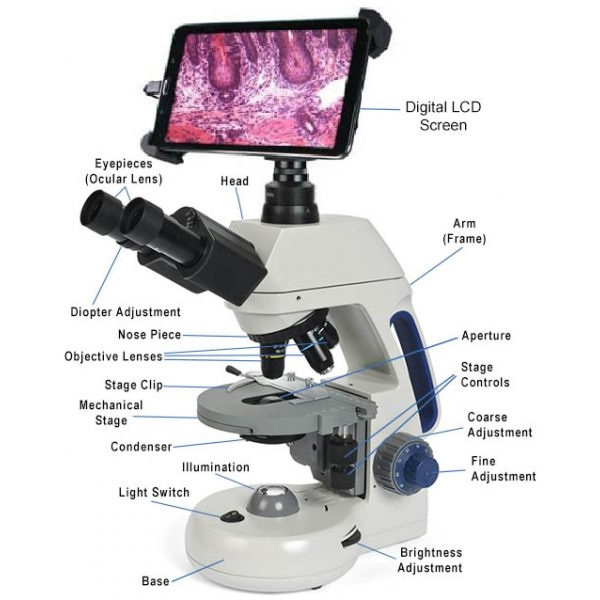

### Tugas 1 Pemrosesan Citra Digital
### Sopia Refaldi
### Ferzy Triwarsana Putra

y
## Pengertian Mikroskop Digital
Mikroskop digital bisa dikatakan merupakan jenis mikroskop model baru yang dilengkapi dengan kamera digital. Mikroskop jenis ini terhubung dengan kamera yang akan menunjukkan output gambar pengamatan pada monitor atau proyektor. Dengan begitu, hasil pengamatan bisa dilihat atau ditunjukkan oleh orang banyak, seperti tenaga pengajar yang ingin menunjukkan hasil pengamatan preparat kepada siswa. Mikroskop digital juga ada yang memiliki kemampuan untuk mengukur dan menampilkan gambar tiga dimensi. Berikut definisi, fungsi, cara kerja, dan bagian mikroskop digital!

- **Definisi Mikroskop digital** merupakan perpaduan mikroskop optik dan kamera digital yang bisa menghasilkan gambar yang bisa tersimpan di dalam komputer. Berbeda dengan mikroskop model lainnya. Di samping itu, mikroskop digital juga tidak lagi mengharuskan Anda melihat objek pengamatan langsung dengan mata melalui lensa pengamat. Mikroskop digital sudah bisa melakukan pengamatan otomatis karena gambar difokuskan pada sirkuit digital dan seluruh gambar dirancang untuk gambar monitor, bukan gambar visual mata manusia.

- **Fungsi mikroskop digital**
Sama seperti mikroskop jenis lainnya, mikroskop digital memiliki fungsi untuk melakukan perbesaran pada objek kecil mikroskopik yang tidak akan mungkin terlihat oleh mata telanjang. Mikroskop ini cocok digunakan untuk penelitian di laboratorium maupun tujuan pendidikan di sekolah maupun universitas.
Mikroskop digital, seperti yang sudah dijelaskan, bisa terhubung atau tersambung dengan komputer, sehingga hasil pengamatan yang dilakukan bisa lebih detail. Di samping itu, hasil pengamatan bisa langsung didokumentasikan ke dalam komputer. Kemampuan mikroskop digital ini sangat membantu dunia penelitian yang membutuhkan ketelitian tingkat tinggi. Hasil pengamatan penelitian tingkat tinggi bisa langsung didokumentasikan dan disimpan di dalam komputer sehingga semua data penelitian aman. 

- Bagian dari Mikroskop Digital
Meskipun ada banyak jenis mikroskop digital dan tujuan penggunaannya, ada beberapa bagian dasar mikroskop digital. Beberapa mikroskop optik dilengkapi dengan kamera mikroskop digital, sementara beberapa menawarkan kemampuan output HDMI/USB. Banyak mikroskop digital menyertakan kamera mikroskop digital dengan lampiran layar LCD untuk menampilkan gambar sementara banyak lainnya mengandalkan monitor komputer USB atau monitor HDMI yang terpisah.

## Cara kerja mikroskop digital

Mikroskop merupakan sebuah alat yang digunakan untuk memeperhatikan benda-benda kecil yang tidak bisa dilihat dengan mata biasa. Dalam penerapannya, mikroskop mampu melihat benda-benda dengan perbesaran hingga puluhan atau ratusan kali.

Mikroskop digital merupakan buah dari perkembangan ilmu teknologi yang semakin canggih. Di mana mikroskop digital ini terdiri dari mikroskop biasa dengan kamera digital yang dibangung ke dalam mikroskop biasa. Gambar akan terlihat melalui mikroskop bisa diproyeksikan ke monitor dan dapat disimpan di file komputer. Sebuah mikroskop digital sangat cocok untuk dunia pendidikan karena memungkinkan bisa menganalisa spesimen dengan lebih jelas dan ditunjukkan dengan lebih mudah.

Mikroskop digital adalah variasi dari mikroskop optik tradisional yang menggunakan optik dan charge coupled device (CCD) kamera ke output gambar digital yang disambungkan ke monitor, atau dengan menggunakan sebuah software yang berjalan pada komputer. Perbedaannya dengan mikroskop tradisional adalah proyeksi gambar pada lensa disambungkan pada kamera CCD tersebut. Seluruh sistem tersebut dirancang untuk gambar monitor.

1. Letakkan mikroskop digital di tempat yang datar dan kuat.
2. Nyalakan komputer dan menyambungkan USB dari mikroskop ke PC.
3. Pasang lampu LED dan sambungkan ke listrik.
4. Nyalakan lampu LED dan atur sesuai dengan kebutuhan. Letakkan preparat ke meja preparat. Kemudian objek diletakkan di sinar yang masuk. Dan pilih lensa obyektif empat kali lebih dulu.
5. Jalankan software aplikasi mikroskop digital.
6. Putar fokus kasar hingga gambar yang muncul pada monitar fokus.
7. Gambar ataupun video yang terekam pada kamera dan terlihat di dalam monitor bisa Anda simpan di tombol simpat.

Mikroskop digital mempunyai fitur yang sangat canggih. Seperti video streaming yang mampu mengamati objek dan menghasilkan citra digital secara realtime. Capturing, yang mampu menangkap gambar yang diamati sesuai dengan citra digital yang terlihat di monitor. Tangkapan gambar tersebut kemudian bisa disimpan dalam file digital berbentuk JPEG  dengan beragam resolusi. Video recording, yang mampu merekam citra digital yang terlihat di monitor dalam rentang waktu yang diinginkan. Rekaman video tersebut bisa Anda simpan sebagai file video.
