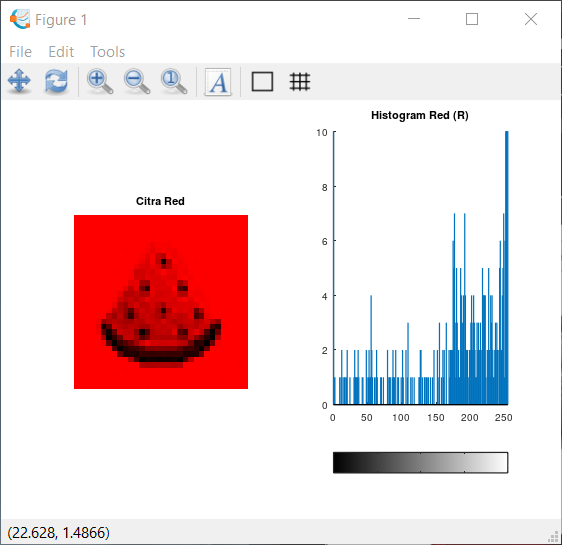
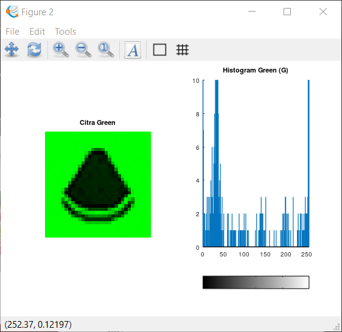
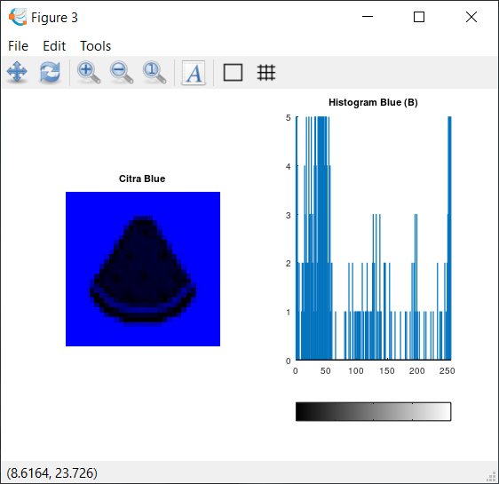
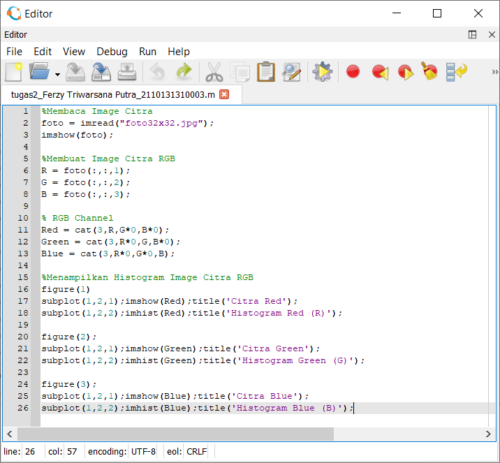

## Nama : Ferzy Triwarsana Putra
## NIM : 2110131310003

# Hasil Eksplorasi Gambar dengan Package Image

* Citra Merah

* Citra Hijau

* Citra Biru

* Source Code

Penjelasan beberapa fungsi yang digunakan pada **source code** :
1. foto, Nama variabel dimana file Image itu disimpan
2. imread, Fungsi untuk membaca file image itu berada
3. imshow, Fungsi untuk menampilkan objek gambar
4. imhist, Fungsi untuk menampilkan image dengan bentuk histogram
5. subplot, Fungsi untuk memasukan objek kedalam 1 figure
6. cat, Fungsi untuk menentukan warna yang akan ditampilkan