## Nama : Ferzy Triwarsana Putra
## NIM : 2110131310003

# Konversikan RGB ke Skala Abu-abu
* ## Original

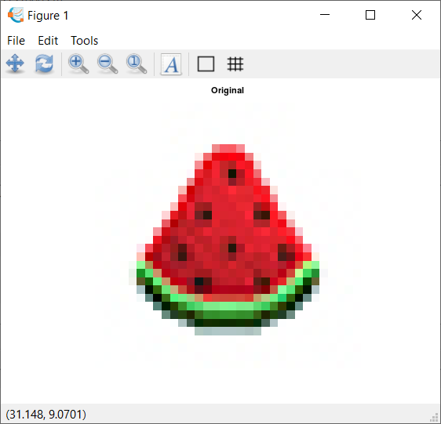

* ## Lightness Method
Metode yang sangat sederhana adalah **dengan mengambil nilai rata-rata komponen dengan nilai tertinggi dan terendah:**

grayscale = min(R,G,B)+max(R,G,B)/2

**Kita dapat dengan mudah melihat bahwa metode ini menghadirkan kelemahan yang sangat serius karena satu komponen RGB tidak digunakan.** Ini jelas merupakan masalah karena jumlah cahaya yang dilihat mata kita bergantung pada ketiga warna dasar.

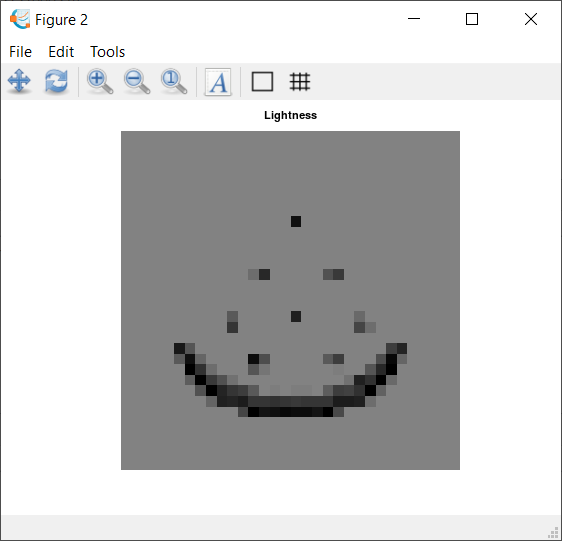

* ## Average Method
Cara lain adalah dengan **mengambil nilai rata-rata dari ketiga komponen (merah, hijau, dan biru) sebagai nilai skala abu-abu:**

grayscale = R+G+B/3

Meskipun sekarang kita memperhitungkan semua komponen, **metode rata-rata juga bermasalah karena memberikan bobot yang sama untuk setiap komponen.** Berdasarkan penelitian tentang penglihatan manusia, kita tahu bahwa mata kita bereaksi terhadap setiap warna dengan cara yang berbeda. **Secara khusus, mata kita lebih sensitif terhadap hijau, lalu merah, dan akhirnya biru.** Oleh karena itu, bobot dalam persamaan di atas harus berubah.

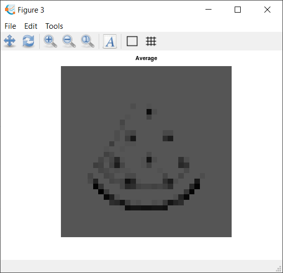

* ## Luminosity Method
Metode terbaik adalah metode luminositas yang berhasil memecahkan masalah dari metode sebelumnya.

Berdasarkan pengamatan di atas, kita harus mengambil rata-rata tertimbang dari komponen. **Kontribusi warna biru pada nilai akhir harus berkurang, dan kontribusi warna hijau harus meningkat. Setelah beberapa percobaan dan analisis yang lebih mendalam, peneliti menyimpulkan dalam persamaan di bawah ini:**

grayscale = 0.3 * R + 0.59 * G + 0.11 * B

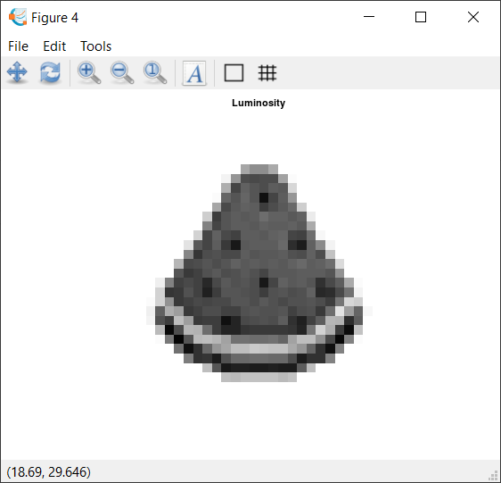

# Source Code

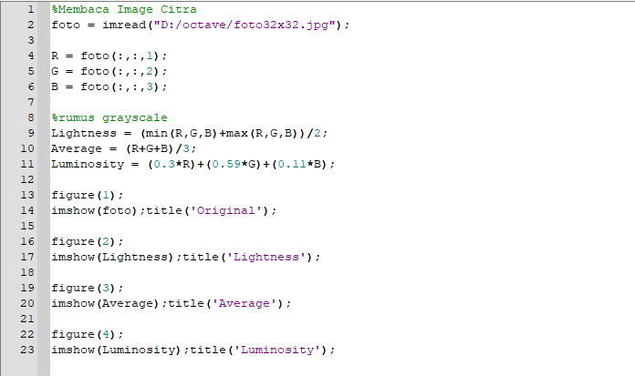

# Halftoning

Halftoning atau halftoning analog adalah proses yang mensimulasikan nuansa abu-abu dengan memvariasikan ukuran titik-titik hitam kecil yang diatur dalam pola yang teratur. Teknik ini digunakan dalam printer, serta industri penerbitan. Jika Anda memeriksa sebuah foto di koran, Anda akan melihat bahwa gambar itu terdiri dari titik-titik hitam meskipun tampaknya terdiri dari abu-abu. Hal ini dimungkinkan karena integrasi spasial yang dilakukan oleh mata kita. Mata kita memadukan detail halus dan merekam intensitas keseluruhan [1]. Halftoning digital mirip dengan halftoning di mana gambar didekomposisi menjadi kotak sel halftone. Elemen (atau titik yang digunakan halftoning dalam mensimulasikan nuansa abu-abu) dari sebuah gambar disimulasikan dengan mengisi sel halftone yang sesuai. Semakin banyak jumlah titik hitam dalam sel halftone, semakin gelap sel tersebut. Misalnya, pada Gambar 4, sebuah titik kecil yang terletak di tengah disimulasikan dalam halftoning digital dengan mengisi sel halftone tengah; demikian juga, titik ukuran sedang yang terletak di sudut kiri atas disimulasikan dengan mengisi empat sel di sudut kiri atas. Titik besar yang menutupi sebagian besar area pada gambar ketiga disimulasikan dengan mengisi semua sel halftone.

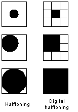

    Gambar 4.1 Contoh halftoning digital

# Patterning

Pola adalah yang paling sederhana dari tiga teknik untuk menghasilkan gambar halftoning digital. Ini menghasilkan gambar yang memiliki resolusi spasial lebih tinggi daripada gambar sumber. Jumlah sel halftone citra keluaran sama dengan jumlah piksel citra sumber. Namun, setiap sel halftone dibagi lagi menjadi kotak 4x4. Setiap nilai piksel input diwakili oleh jumlah kotak terisi yang berbeda dalam sel halftone. Karena kisi 4x4 hanya dapat mewakili 17 tingkat intensitas yang berbeda, gambar sumber harus dikuantisasi. Gambar 4.2 menunjukkan matriks pola rekursif Rylander, yang akan digunakan dalam daftar 4.1, dan contoh operasi pola.

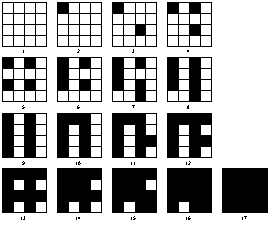

    Gambar 4.2 Matriks pola rekursif Rylander

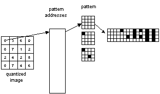

    Gambar 4.3 Operasi Patterning

NAMA

pattern - menghasilkan gambar halftoning digital dari gambar input melalui pola.

RINGKASAN

pola(nama_file_input, nama_file_output)

KETERANGAN

pattern menghasilkan gambar halftoning digital dari gambar input menggunakan teknik pola. Pola program membaca gambar input, mengkuantisasi nilai piksel, dan memetakan setiap piksel ke pola yang sesuai. Gambar yang dihasilkan 16 kali lebih besar dari aslinya. Gambar yang dihasilkan ditulis ke file output sebagai file TIFF. Sebuah kata peringatan: "pola" membutuhkan banyak perhitungan, gambar berukuran kurang dari 100x100 direkomendasikan.

CONTOH

pola('PAINTER.TIF', 'pa_ptr.tif')

Contoh ini menghasilkan gambar halftoning digital dari PAINTER menggunakan teknik pola (Gambar 4.4)

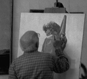
a. Original PAINTER

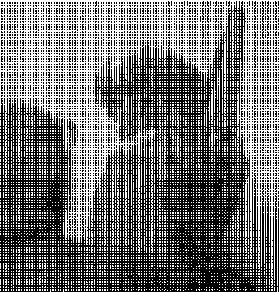
b. Digital halftoning image of PAINTER via patterning

    Figure 4.4 Digital halftoning via patterning

# Dithering

Teknik lain yang digunakan untuk menghasilkan gambar halftoning digital adalah dithering. Tidak seperti pola, dithering membuat gambar keluaran dengan jumlah titik yang sama dengan jumlah piksel pada gambar sumber. Dithering dapat dianggap sebagai thresholding gambar sumber dengan matriks gentar. Matriks diletakkan berulang kali di atas gambar sumber. Dimanapun nilai piksel gambar lebih besar dari nilai dalam matriks, titik pada gambar output diisi. Masalah dithering yang terkenal adalah menghasilkan artefak pola yang diperkenalkan oleh matriks ambang batas tetap. Gambar 4.5 menunjukkan contoh operasi dithering.

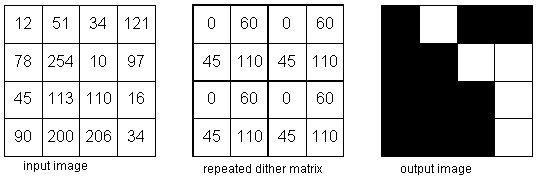

    Gambar 4.5 Operasi dithering

    Listing 4.2 adalah implementasi MATLAB dari proses dithering.

NAMA

dither - menghasilkan gambar halftone digital melalui dithering

RINGKASAN

dither (nama_file_input, nama_file_output)

dither (nama_file_input, nama_file_output, dmatrix)

KETERANGAN

Sinopsis pertama menggunakan matriks gentar default untuk ambang batas gambar input. Kekhawatiran default adalah

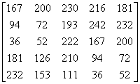

Matriks ini adalah matriks gentar persegi panjang yang diekstraksi dari matriks gentar 450. 450 matriks gentar dapat membuat artefak kurang jelas. Sinopsis kedua, di sisi lain, menggunakan matriks gentar yang ditentukan oleh pengguna. gentar membaca dalam gambar input, membandingkan setiap piksel dengan elemen yang sesuai dalam matriks gentar, menghasilkan gambar output, dan menulisnya ke file output, yang dalam format TIFF. Sebuah kata peringatan: karena "gentar" membutuhkan banyak perhitungan, gambar berukuran kurang dari 100x100 direkomendasikan.

CONTOH

dither('LENA.TIF', 'di_le.tif')

Contoh ini menghasilkan gambar halftone digital dari LENA menggunakan matriks gentar default (Gambar 4.5a.)

dither('S_PAINTER.TIF', 'di_spa.tif', [105,135,30;90,67.5,120;45,15,45;])

Contoh ini menghasilkan gambar halftone digital dari PAINTER menggunakan matriks gentar yang ditentukan oleh pengguna (Gambar 4.5b.)

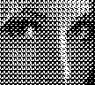
a. Dithered LENA

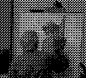
b. Dithered PAINTER

    Gambar 4.5 Contoh gambar keluaran dithering

# Menentukan Pola Patterning dan Dithering
* Patterning
* Dithering
* Matriks Threshold

Dalam proses ini dibutuhkan suatu nilai batas yang disebut dengan nilai threshold.

Nilai intensitas citra yang lebih dari atau sama dengan nilai threshold akan diubah menjadi 1 (berwarna putih) sedangkan nilai intensitas citra yang kurang dari nilai threshold akan diubah menjadi 0 (berwana hitam). Sehingga citra keluaran dari hasil thresholding adalah berupa citra biner.

Persamaan yang digunakan untuk mengkonversi nilai piksel citra grayscale menjadi biner pada metode thresholding adalah:

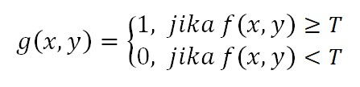

di mana

f(x,y) adalah citra grayscale

g(x,y) adalah citra biner

T adalah nilai threshold

Ilustrasi perubahan nilai piksel pada proses thresholding

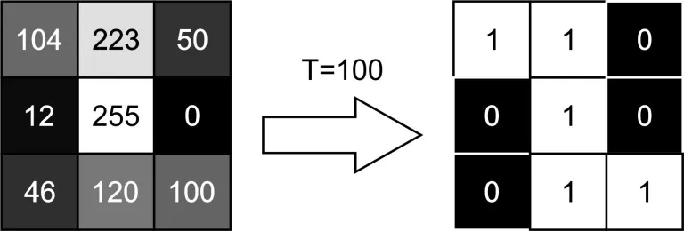

Berikut ini merupakan contoh citra hasil thresholding dengan beberapa variasi nilai threshold

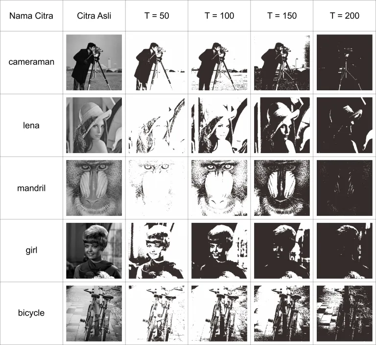

Gambar diatas menunjukkan bahwa semakin kecil nilai threshold maka akan semakin banyak warna putih yang diperoleh pada citra biner, sedangkan semakin besar nilai threshold maka akan semakin banyak warna hitam yang diperoleh.