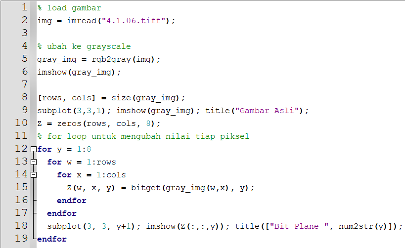
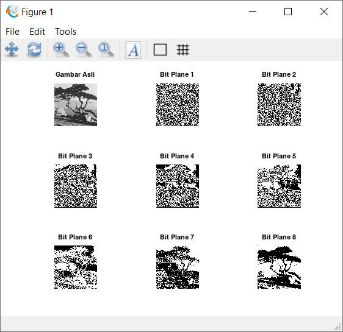
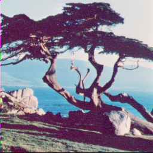
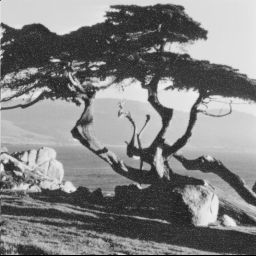

## Nama : Ferzy Triwarsana Putra
## NIM : 2110131310003
# Bit Plane Slicing

Bit-plane slicing merupakan metode yang digunakan untuk melihat konstribusi atau pengaruh tiap bit penyusun citra.

Untuk citra 8 bit, pada dasarnya tiap intensitas yang nilainya dalam format decimal, bisa dipecah menjadi bit-bit dalam format biner. Misalnya, sebuah pixel dengan intensitas 245 (decimal) bila dijadikan biner adalah 11110101.

contoh penerapan bit plane slicing pada octave

* Source Code

* Hasil :

Awalnya kita mengambil gambar yang telah ditentukan, kemudian diubah ke grayscale menggunakan rgb2gray, setelah itu ukuran gambar kita pisah menjadi ukuran row dan ukuran column lalu kita tampilkan gambar asli yang sudah grayscale menggunakan subplot dengan ukuran 3x3 pada posisi 1 dengan judul gambar asli, kemudian kita buat matriks dalam Z denga nisi 0 semuanya dengan ukuran yang sama dengan gambar, dan 8 layer karena nanti tiap bit dipisah menjadi 8 lapis.

# STEGANOGRAFI

Steganografi atau Steganography secara umum adalah sebuah ilmu, teknik atau seni menyembunyikan sebuah pesan rahasia dengan suatu cara sehingga pesan tersebut hanya akan diketahui oleh si pengirim dan si penerima pesan rahasia tersebut.

Steganografi adalah sebuah metode dalam pemrosesan citra digital untuk menyembunyikan suatu data rahasia ke dalam sebuah citra.
Data yang disembunyikan dapat berupa:
* Gambar
* Teks
* Suara

Langkah-langkah metode steganografi berbasis LSB
* Ambil pesan rahasia dan ubah ke format biner.
* Ambil gambar sampul dan ubah menjadi skala abu-abu. (Menggunakan skala abu-abu jauh lebih nyaman karena gambar skala abu-abu 8-bit per piksel akan memiliki urutan 8 bit dibandingkan dengan gambar berwarna 24-bit per piksel dengan urutan 24-bit.)
* Untuk setiap piksel dalam gambar, ambil nilai intensitas (berbaring di kisaran 0 hingga 255) dan ubah ke format biner.
* Ambil bit paling kanan atau LSB dan ganti dengan bit dari pesan rahasia.
* Ulangi ini sampai semua bit pesan rahasia telah disematkan. Citra tersebut kemudian akan disebut sebagai citra stego.
* Proses ini diikuti secara terbalik di tempat tujuan untuk memecahkan kode pesan tersembunyi dari gambar stego.

Menerapkan pada octave

    % load citra dan ambil ukurannya (width dan height)
    img = imread("4.1.06.tiff");
    cover_img = rgb2gray(img);
    [img_height, img_width] = size(cover_img);

    pesan = "Ferzy Triwarsana Putra 2110131310003";
    panjang_pesan = length(pesan) * 8;

    % menggunakan fungsi uint8 untuk mengambil ascii
    ascii_pesan = uint8(pesan);

    % mengambil nilai biner dari pesan
    biner_pesan = dec2bin(ascii_pesan, 8);

    % mengubah biner_pesan ke dalam bentuk 1 baris
    biner_pesan = transpose(biner_pesan);
    biner_pesan = biner_pesan(:);
    biner_pesan = str2num(biner_pesan);

    % copy cover ke citra hasil
    stego_img = cover_img;

    % traverse cover img
    counter = 1;

    for x = 1:img_height
        for y = 1:img_width
            if (counter <= panjang_pesan)
                LSB = bitget(cover_img(x, y), 1);
                BPS = biner_pesan(counter);
                temp = xor(LSB, BPS);
                stego_img(x, y) = cover_img(x, y) + temp;
                counter = counter + 1;
            else
                break;
            end
        end
    end

    % simpan gambar
    imwrite(stego_img, 'stego.png');

* citra asli

* citra yang sudah disisipkan

