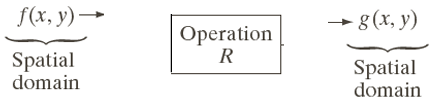
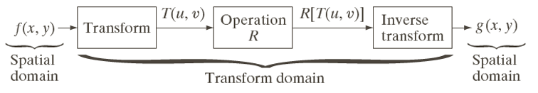
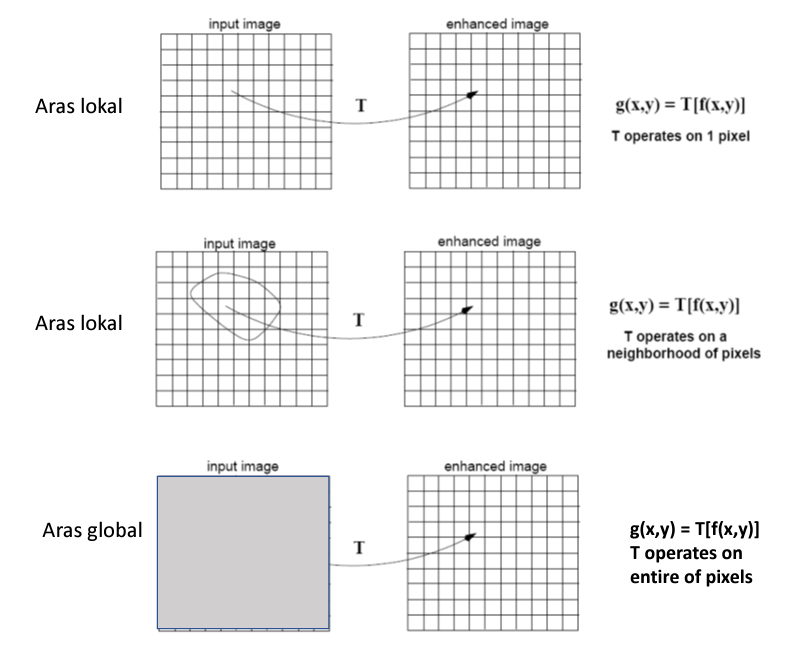

# Nama : Ferzy Triwarsana Putra
# NIM : 2110131310003

# IMAGE ENHANCEMENT
Image enhancement adalah proses mendapatkan citra yang lebih mudah diinterpretasikan oleh mata manusia (Human Visual System/HVS). Proses ini merupakan salah satu proses awal dalam pengolahan citra (image preprocessing). Untuk meningkatkan kualitas hasil proses image enhancement maka lebih baik manipulasi citra dilakukan dalam domain frekuensi. Beberapa jenis transformasi yang dapat digunakan untuk mengubah citra dari domain spasial ke domain frekuensi antara lain, transformasi fourier, transformasi gelombang-singkat (wavelet transform), Discrete Cosine Transform (DCT), dan sebagainya. Citra yang terbentuk menjadi berkualitas buruk karena mengalami derau (noise) pada saat pengambilan (capture) gambar, pengiriman melalui saluran transmisi, terlalu terang/gelap, kurang tajam, kabur dan sebagainya. singkatnya Image enhancement adalah proses agar citra menjadi lebih baik ‘secara visual’ untuk aplikasi tertentu.

Pada proses perbaikan kualitas citra, ciri-ciri tertentu dalam citra lebih diperjelas kemunculannya. Secara matematis:

        f(x,y) --> (x,y)                    (1)

Ciri-ciri pada f(x,y) lebih ditonjolkan.

Pada proses pelembutan dan penajaman citra merupakan operasi penapisan (filtering), sehingga dilakukan operasi konvolusi citra f(x,y) dan filter h(x,y). Secara matematis dalam domain spasial dirumuskan sebagai berikut:

        f’(x,y) = h(x,y) * f(x,y)           (2)

dan dalam domain frekuensi

        F’(u,v) = H(u,v) F(u,v)             (3)

Proses pemilihan H(u,v) yang tepat dalam rangka menonjolkan ciri citra f(x,y). Pada umumnya nilai f(x,y) sudah diketahui yang merupakan citra asli, persoalannya adalah memilih filter h(x,y) yang tepat untuk dapat menonjolkan ciri tertentu dari citra asli. Dalam domain frekuensi, umumnya citra yang mengalami gangguan yaitu pada frekuensi tinggi sehingga dilakukan proses penyaringan yang dapat menapis frekuensi tinggi High Pass Filter (HPF) dan meloloskan frekuensi rendah yaitu Low Pass Filter (LPF)

Berdasarkan ranah (domain) operasinya, metode-metode untuk perbaikan kualitas citra dikelompokkan menjadi dua kategori:
1. Image enhancement dalam ranah spasial
2. Image enhancement dalam ranah frekuensi

* Spatial Domain

* Frequency Domain (misalnya menggunakan Fourier Transform)

* Metode-metode image enhancement dalam ranah spasial dilakukan dengan memanipulasi secara langsung pixel-pixel di dalam citra.
* Metode-metode image enhancement dalam ranah frekuensi dilakukan dengan mengubah citra terlebih dahulu dari ranah spasial keranah frekuensi, baru kemudian memanipulasi nilai-nilai frekuensi tersebut.
* Masing-masing ranah operasi digunakan untuk tujuan spesifik, karena tidak semua perbaikan citra dapat dilakukan dalam ranah spasial.

## Metode dalam Ranah Spasial
* Misalkan :
* f(x,y) : citra input
* g(x,y) : citra output
* T adalah operator terhadap f

* Metode pemrosesan citra dalam ranah spasial dinyatakan sebagai :
        
        g(x,y) = T [f(x,y)]

* T bisa beroperasi pada satu pixel, sekelompok pixel bertetanga, atau keseluruhan pixel di dalam citra.

* Jadi, metode dalam ranah spasial dapat dilakukan pada aras titik(pixel), aras lokal, dan aras global.

Proses-proses yang termasuk kedalam perbaikan kualitas citra:
* Pengubahan kecerahan gambar (image brightening)
* Citra negatif (image negatives)
* Peregangan kontras (contrast stretching) 
* Pengubahan histogram citra.
* Pelembutan citra (image smoothing)
* Penajaman (sharpening) tepi(edge).
* Pewarnaansemu(pseudocolouring)
* Pengubahan geometrik
* dll